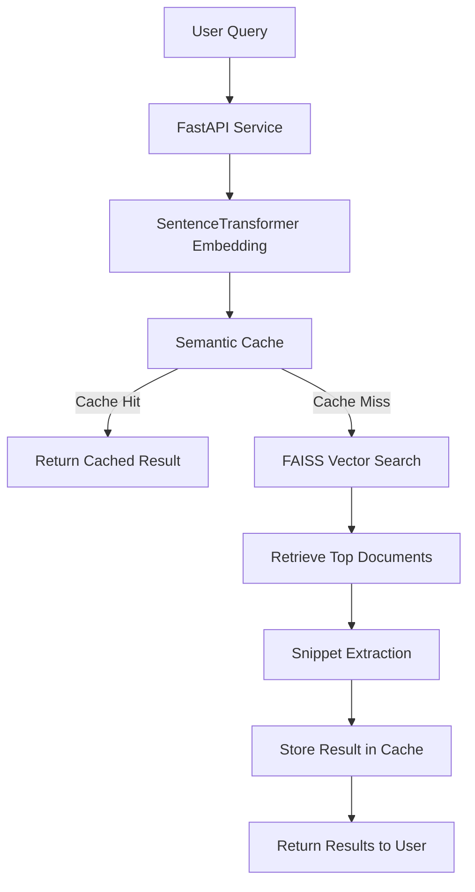
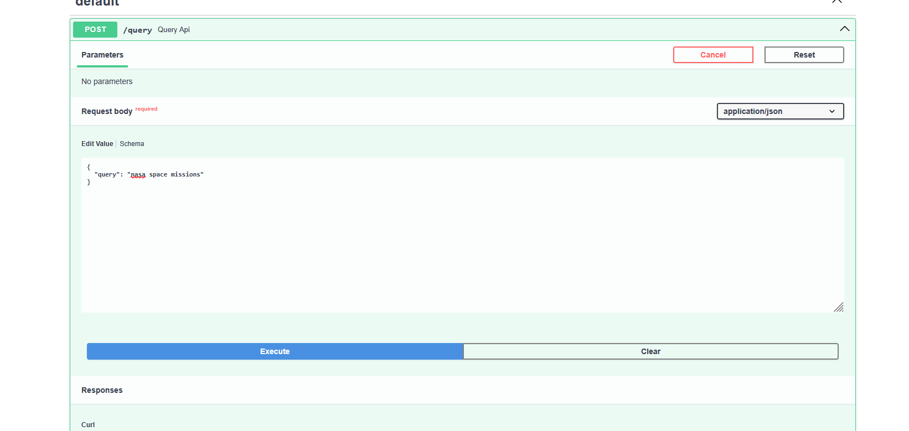
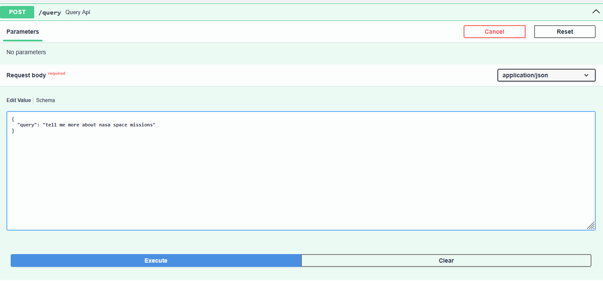
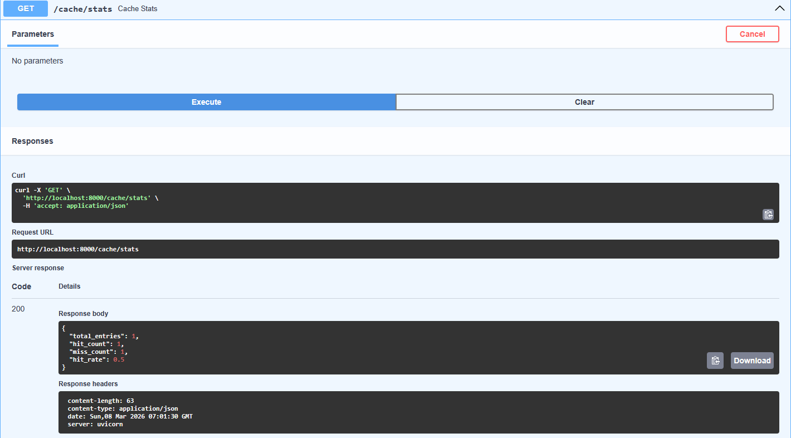
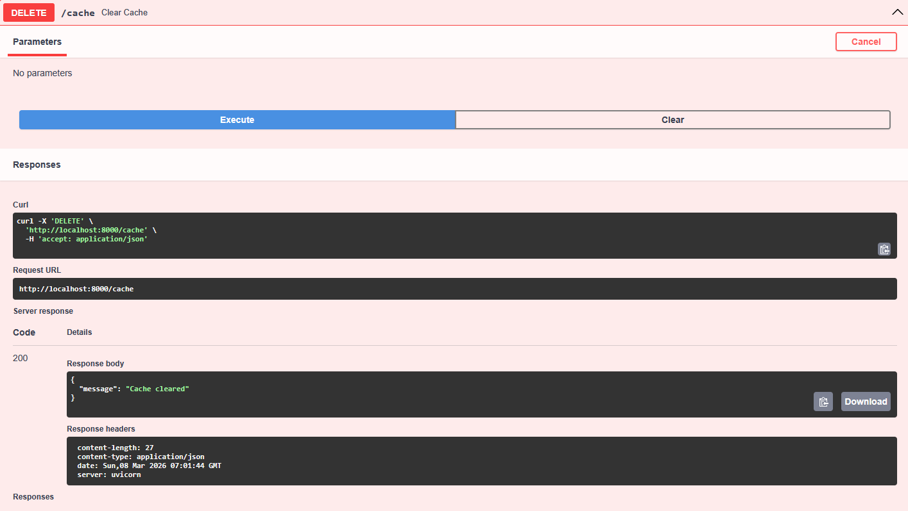
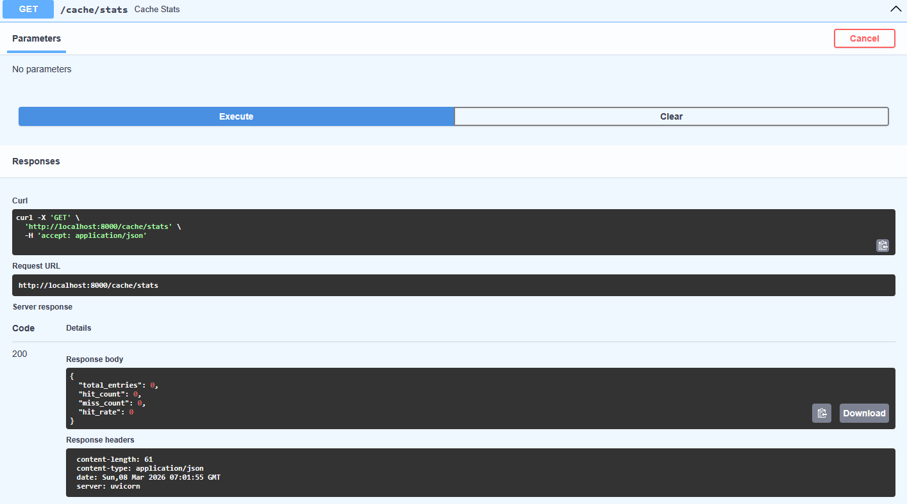

# Semantic Search System with Fuzzy Clustering and Semantic Cache


---

# Overview

This project implements a **semantic search system** for the **20 Newsgroups dataset** using modern Natural Language Processing techniques.

Unlike traditional keyword search systems, this project uses **transformer-based sentence embeddings** and **vector similarity search** to retrieve documents that are **semantically related to a query**.

The system also explores **unsupervised topic discovery using fuzzy clustering** and introduces a **semantic cache layer** that allows the system to reuse results when similar queries appear.

The final system is deployed as a **FastAPI service**, enabling real-time query processing through a REST API.

---

# System Architecture

The system is designed with a **modular architecture** that separates data processing, retrieval logic, and API services.

## System Architecture Diagram



---

# Query Processing Pipeline

The full query execution pipeline is:

```
User Query
↓
SentenceTransformer embedding
↓
Semantic cache lookup
↓
If cache hit → return cached result
↓
If cache miss → FAISS vector search
↓
Retrieve top documents
↓
Extract most relevant snippet
↓
Store result in cache
↓
Return response
```

---

# Dataset

This project uses the **20 Newsgroups dataset**, a widely used benchmark corpus for text classification and clustering research.

The dataset contains approximately **20,000 Usenet messages** divided into **20 topic categories**, including:

* sci.space
* rec.sport.baseball
* talk.politics.guns
* comp.graphics
* alt.atheism
* and others

Each message contains typical Usenet formatting such as:

* headers
* email addresses
* quoted replies
* signatures

During preprocessing, these artifacts are removed to ensure embeddings capture the **actual semantic content of the message body**.

---

# Embedding Strategy

To convert text into semantic vectors, the system uses the transformer model:

**SentenceTransformer — `all-MiniLM-L6-v2`**

Reasons for choosing this model:

* Lightweight and efficient
* Produces **384-dimensional embeddings**
* Strong performance on semantic similarity benchmarks
* Commonly used in semantic search systems

Each document is represented as:

```
Document → 384 dimensional embedding vector
```

These embeddings allow documents and queries to be compared using **cosine similarity**.

---

# Vector Database (FAISS)

To perform fast similarity search across thousands of embeddings, the system uses:

**FAISS — Facebook AI Similarity Search**

Index type used:

```
IndexFlatL2
```

This index computes the Euclidean distance between query embeddings and document embeddings to retrieve the most similar documents.

Advantages of FAISS:

* extremely fast nearest-neighbor search
* optimized for high-dimensional vectors
* widely used in production ML systems

---

# Fuzzy Clustering (Topic Discovery)

To explore semantic structure in the embedding space, the project applies **Gaussian Mixture Model (GMM)** clustering.

Unlike hard clustering methods such as **K-Means**, GMM assigns **probabilities of belonging to each cluster**.

Example:

```
Document A

Cluster 3 → 0.71
Cluster 7 → 0.22
Cluster 12 → 0.07
```

This reflects the fact that many documents discuss **multiple topics simultaneously**.

The optimal number of clusters was selected using the **Bayesian Information Criterion (BIC)**, which balances model complexity with data likelihood.

---

# Cluster Analysis

Several experiments were conducted to understand the clustering behavior.

### Cluster Probability Analysis

Most documents show a **dominant cluster probability above 0.7**, indicating strong semantic grouping.

### t-SNE Visualization

A **t-SNE projection** was used to visualize the high-dimensional embedding space.

The visualization reveals **clear separation between topic groups**, confirming that transformer embeddings capture meaningful semantic structure.

### Cluster Size Distribution

Cluster sizes range approximately between **700 and 1400 documents**, suggesting balanced semantic grouping across topics.

---

# Semantic Cache Design

Traditional caching relies on **exact query matches**, which fails when users ask similar questions using different wording.

Example:

```
"What is NASA's mission?"
"Tell me about NASA space programs"
```

Although these queries are semantically similar, a traditional cache would treat them as different.

This system implements a **semantic cache** using embedding similarity.

### Cache Workflow

1. Convert query to embedding
2. Compare with cached query embeddings
3. Compute cosine similarity
4. If similarity > **0.85**, reuse cached result

This significantly reduces redundant search computation.

---

# API Service

The semantic search system is exposed through a **FastAPI application**.

---

## Endpoint: Semantic Query

```
POST /query
```

Example request:

```json
{
  "query": "nasa space mission"
}
```

Example response:

```json
{
  "query": "nasa space mission",
  "cache_hit": false,
  "matched_query": null,
  "similarity_score": null,
  "dominant_cluster": 3,
  "result": [
    "NASA (The National Aeronautics and Space Administration) is the civilian space agency of the United States federal government."
  ]
}
```

Response fields:

| Field            | Description                               |
| ---------------- | ----------------------------------------- |
| query            | Original query text                       |
| cache_hit        | Indicates whether results came from cache |
| matched_query    | Cached query that matched                 |
| similarity_score | Cosine similarity with cached query       |
| dominant_cluster | Cluster predicted by GMM                  |
| result           | Top retrieved document snippets           |

---

## Endpoint: Cache Statistics

```
GET /cache/stats
```

Returns:

* number of cache entries
* cache hits
* cache misses
* hit rate

---

## Endpoint: Clear Cache

```
DELETE /cache
```

Clears all cached entries.

---

# API Usage Demonstration

Here is a step-by-step demonstration of the API and semantic cache in action:

### 1. First Query (Cache Miss)
Running an initial semantic query. This performs a full FAISS vector search.


### 2. Similar Query (Cache Hit)
Running a semantically similar query. The system detects the similarity and returns a cache hit.


### 3. Cache Statistics
Checking the cache stats gives us the current hit rate and number of successful cache hits.


### 4. Clear Cache
Deleting all records to clear the semantic cache.


### 5. Verify Cache Clear
Checking the cache stats again shows that the cache is now empty (0 hits and 0 entries).


---

# Project Structure

```
trademarkia-semantic-search/

api/
    main.py

src/
    embeddings.py
    vector_store.py
    search_engine.py
    semantic_cache.py
    clustering.py

notebooks/
    semantic_search_system.ipynb

data/
    20_newsgroups/
    mini_newsgroups/
    gmm_model.pkl

requirements.txt
README.md
```

---

# Running the Project

### Install dependencies

```
pip install -r requirements.txt
```

### Generate embeddings and clustering model

Run the notebook:

```
notebooks/semantic_search_system.ipynb
```

This will generate:

```
data/embeddings.npy
data/documents.txt
data/gmm_model.pkl
```

---

### Start API server

```
uvicorn api.main:app --reload
```

Open interactive API documentation:

```
http://127.0.0.1:8000/docs
```

---

# Future Improvements

Potential extensions include:

* cluster-aware semantic search
* approximate FAISS indices for larger datasets
* automatic cache eviction strategies
* hybrid search combining semantic and keyword retrieval
* distributed vector search infrastructure

---

# Conclusion

This project demonstrates how modern NLP techniques can be combined to build an **intelligent semantic retrieval system**.

By integrating:

* transformer embeddings
* FAISS vector similarity search
* fuzzy clustering
* semantic caching
* REST API deployment

the system provides a **scalable architecture for semantic document search**.