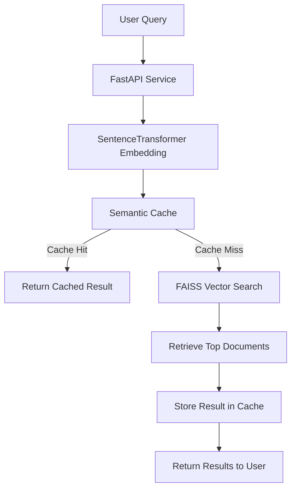

# Semantic Search System with Fuzzy Clustering and Semantic Cache


## Overview

This project implements a **semantic search system** for the **20 Newsgroups dataset** using modern NLP techniques.
Instead of traditional keyword matching, the system uses **transformer-based embeddings** and **vector similarity search** to retrieve semantically related documents.

In addition to semantic search, the project explores **unsupervised topic discovery using fuzzy clustering** and implements a **semantic cache layer** to reuse results for similar queries.

The final system exposes these capabilities through a **FastAPI service**, enabling real-time query handling.

---

# System Architecture

The system follows a modular architecture designed for clarity, scalability, and experimentation.

## System Architecture Diagram



The system follows a layered architecture.

User queries are first processed through a FastAPI service, which converts the input text into a semantic embedding using a SentenceTransformer model.

Before performing a search, the system checks a semantic cache that stores embeddings of previously processed queries. If a semantically similar query is found, the cached results are returned immediately.

If no match is found, the query embedding is passed to a FAISS vector index that performs similarity search against all document embeddings.

The most similar documents are returned as results and also stored in the semantic cache for faster responses to future queries.

---

# Dataset

This project uses the **20 Newsgroups dataset**, a widely used corpus for text classification and clustering.

The dataset contains approximately **20,000 Usenet posts** organized into **20 topic categories**, including:

* sci.space
* rec.sport.baseball
* talk.politics.guns
* comp.graphics
* alt.atheism
* and others

Each document contains typical email-style formatting such as headers, quotes, and signatures.

During preprocessing, headers, footers, and quoted replies are removed to ensure embeddings capture the **actual semantic content** of the messages.

---

# Embedding Strategy

To represent documents in a semantic vector space, the system uses the transformer model:

**SentenceTransformer — `all-MiniLM-L6-v2`**

Reasons for choosing this model:

* Lightweight and efficient
* Produces **384-dimensional embeddings**
* Strong performance on semantic similarity tasks
* Widely used for semantic search systems

Each document is converted into a dense embedding vector.

Example representation:

```
Document → 384-dimensional vector
```

These vectors enable **semantic comparison between texts using cosine similarity**.

---

# Vector Database (FAISS)

To perform fast similarity search over the embedding vectors, the project uses **FAISS (Facebook AI Similarity Search)**.

FAISS enables efficient **nearest neighbor search** in high-dimensional spaces.

Index type used:

```
IndexFlatL2
```

This index computes Euclidean distance between query vectors and document embeddings to retrieve the most relevant documents.

Advantages:

* Extremely fast
* Optimized for large vector datasets
* Widely used in production ML systems

---

# Fuzzy Clustering (Topic Discovery)

To explore the structure of the embedding space, the project applies **Gaussian Mixture Model (GMM)** clustering.

Unlike hard clustering methods such as K-Means, GMM produces **probabilistic cluster memberships**.

Example output:

```
Document A:
Cluster 3 → 0.71
Cluster 7 → 0.22
Cluster 12 → 0.07
```

This allows documents to belong partially to multiple clusters, reflecting the reality that many discussions involve **multiple topics**.

The number of clusters was selected using the **Bayesian Information Criterion (BIC)**, which balances model complexity and goodness of fit.

---

# Cluster Analysis

Several analyses were conducted to validate clustering behavior:

### Cluster Probability Analysis

The model assigns very high probability to a dominant cluster for most documents, indicating strong semantic separation in the embedding space.

### t-SNE Visualization

To visualize the high-dimensional embeddings, **t-Distributed Stochastic Neighbor Embedding (t-SNE)** was applied to a sample of documents.

The resulting 2D projection shows clearly separated regions corresponding to different semantic topics.

### Cluster Size Distribution

Cluster sizes range between approximately **700 and 1400 documents**, indicating that the model captures a diverse set of topics rather than collapsing documents into a few dominant clusters.

---

# Semantic Cache Design

Traditional caching systems rely on **exact query matching**, which fails when users ask the same question in different ways.

Example:

```
"What is NASA's mission?"
"Tell me about NASA space programs"
```

Although these queries are semantically similar, a standard cache would treat them as different.

This project implements a **semantic cache** using embedding similarity.

## Cache Workflow

1. Convert the query to an embedding
2. Compare the embedding with cached query embeddings
3. Compute cosine similarity
4. If similarity exceeds a threshold (0.85), reuse cached results

This allows the system to reuse results for **semantically similar queries**, reducing redundant computation.

---

# API Service

The system is exposed through a **FastAPI application**.

### Endpoint: Query Search

```
POST /query
```

Example request:

```json
{
  "query": "nasa space mission"
}
```

Example response:

```json
{
  "query": "nasa space mission",
  "cache_hit": false,
  "result": [
    "Archive-name: space/addresses..."
  ]
}
```

If the same or a similar query is submitted again:

```
"cache_hit": true
```

---

### Endpoint: Cache Statistics

```
GET /cache/stats
```

Returns:

* total cached entries
* cache hits
* cache misses
* hit rate

---

### Endpoint: Clear Cache

```
DELETE /cache
```

Removes all cached entries.

---

# Project Structure

```
trademarkia-semantic-search/

api/
    main.py

src/
    embeddings.py
    vector_store.py
    search_engine.py
    semantic_cache.py
    clustering.py

notebooks/
    semantic_search_system.ipynb

data/
    20_newsgroups/
    mini_newsgroups/

requirements.txt
README.md
```

---

# Running the Project

### Install dependencies

```
pip install -r requirements.txt
```

### Generate embeddings

Run the notebook:

```
notebooks/semantic_search_system.ipynb
```

This will generate:

```
data/embeddings.npy
data/documents.txt
```

### Start API

```
uvicorn api.main:app --reload
```

Open interactive documentation:

```
http://127.0.0.1:8000/docs
```

---

# Future Improvements

Several improvements could further enhance the system:

* Cluster-aware cache indexing
* Approximate FAISS indices for larger datasets
* Automatic cache eviction policies
* Query routing using cluster predictions
* Hybrid search combining semantic and keyword retrieval

---

# Conclusion

This project demonstrates how modern NLP techniques can be combined to build a **practical semantic search system**.

By integrating:

* transformer embeddings
* vector similarity search
* fuzzy clustering
* semantic caching
* API deployment

the system provides a scalable architecture for intelligent document retrieval.